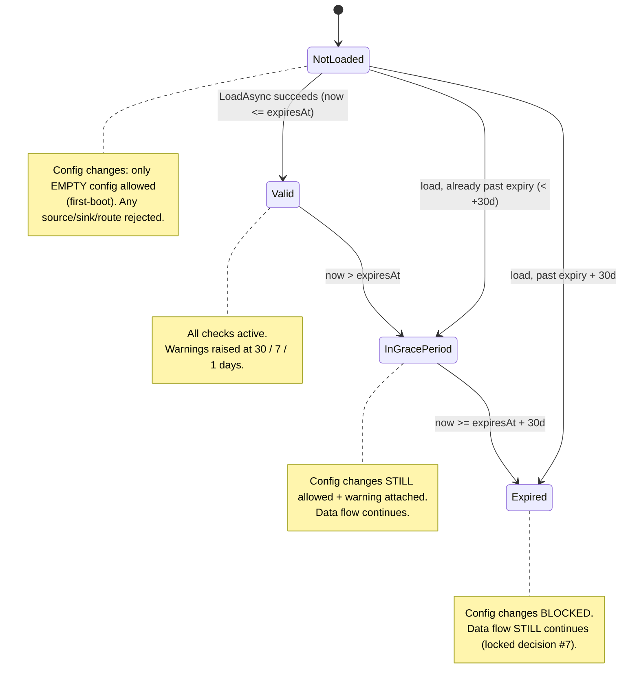
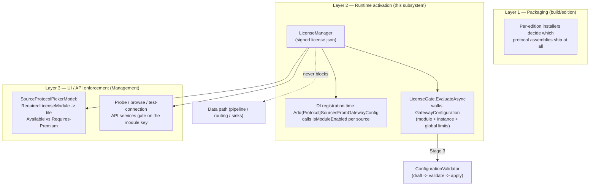
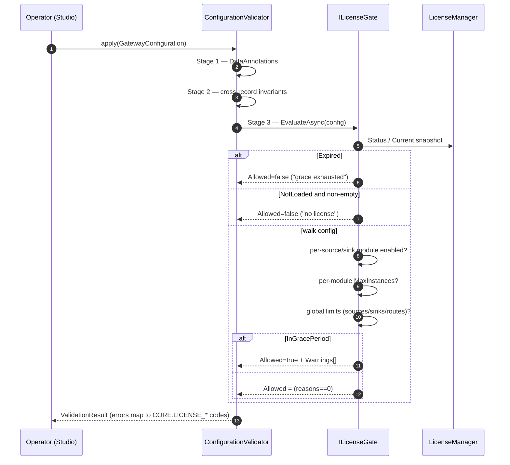
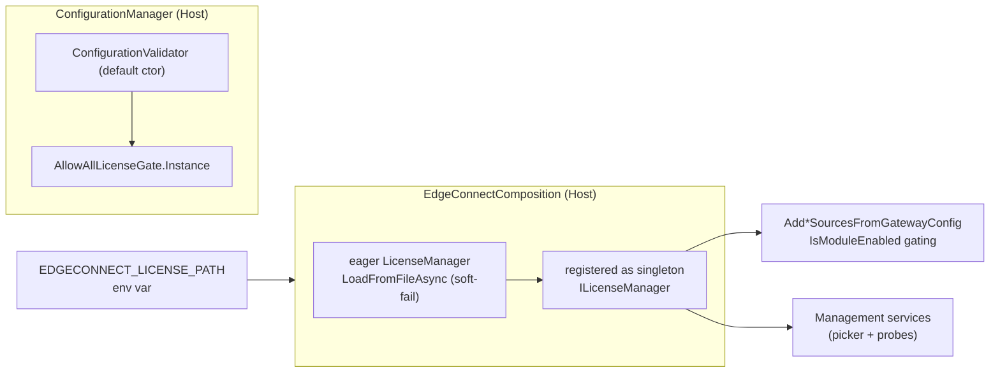

# Elpis EdgeConnect — License Manager Architecture

**Status:** Descriptive architecture reference for the licensing subsystem (Core Milestone B3).
**Reference:** `ARCHITECTURE_BLUEPRINT.md` §7 (Licensing), `PHASE1_EXECUTION_PLAN.md` Milestone B3,
`docs/licensing/license-file-format.md`, `docs/licensing/module-catalog.md`.
**Scope:** `src/ElpisEdgeConnect.Core/Licensing/` plus its host and management-layer consumers.

> This document diagrams what is **actually implemented today**. Where the code
> and the format spec differ (notably the module-key naming between layers, and
> the default host wiring of the config-time gate), the difference is called out
> explicitly rather than smoothed over. Diagrams are Mermaid and render on GitHub.

---

## 1. One-paragraph summary

The **License Manager** loads a single RSA-PSS/SHA-256 signed `license.json`
fully offline, verifies its signature against a public key embedded in the
binary, parses it into an immutable frozen snapshot, and exposes lock-free
fast-path checks (`IsModuleEnabled`, `IsFeatureEnabled`, `CheckInstanceLimit`)
plus a lifecycle status (`Valid → InGracePeriod → Expired`). Three enforcement
layers consume it: (1) **DI-registration-time** per-adapter gating in the host,
(2) the **config-apply gate** (`LicenseGate`), and (3) the **management UI/API**
(license-aware wizard tiles + probe endpoints). Per locked decision #7 the data
path is **never** blocked on a license check — expiry only blocks configuration
changes.

---

## 2. Component / type map

```mermaid
classDiagram
    direction LR

    class ILicenseManager {
        <<interface>>
        +LicenseInfo? Current
        +LicenseStatus Status
        +TimeSpan? RemainingGrace
        +event WarningRaised
        +LoadFromFileAsync(path, ct) Task
        +LoadAsync(stream, ct) Task
        +IsModuleEnabled(key) bool
        +IsFeatureEnabled(key) bool
        +CheckInstanceLimit(key, count) LicenseEvaluationResult
        +Tick() void
    }

    class LicenseManager {
        -LicenseInfo? _snapshot
        -LicenseStatus _status
        -SemaphoreSlim _loadLock
        -HashSet~string~ _raisedWarnings
        +LicenseManager()
        +LicenseManager(validator, policy?, utcNow?)
    }

    class LicenseSignatureValidator {
        +Verify(canonical, base64Sig) bool
        RSA_PSS SHA256 MGF1
    }
    class EmbeddedPublicKey {
        <<static>>
        +Pem : string
        +Fingerprint : string
    }
    class CanonicalJson {
        <<static>>
        +CanonicalizeRoot(element) byte[]
        +SignaturePropertyName
    }
    class LicenseExpirationTracker {
        <<static>>
        +Evaluate(now, expiresAt, policy) LicenseExpirationSnapshot
    }
    class LicenseEnforcementPolicy {
        +GracePeriod = 30d
        +WarnDays = {30,7,1}
        +Default
    }

    class LicenseInfo {
        <<record>>
        +LicenseId, Customer, GatewayId
        +Edition, IssuedAt, ExpiresAt
        +LicenseLimits Limits
        +FrozenDictionary~string,LicenseModule~ Modules
        +FrozenDictionary~string,bool~ Features
    }
    class LicenseModule {
        +bool Enabled
        +int? MaxInstances
    }
    class LicenseLimits {
        +MaxSourceInstances
        +MaxSinkInstances
        +MaxRoutes
    }
    class LicenseStatus {
        <<enum>>
        NotLoaded
        Valid
        InGracePeriod
        Expired
    }
    class LicenseWarning {
        +Level, Code, Message
        +DaysUntilExpiry, Status, RaisedAtUtc
    }

    class ILicenseGate {
        <<interface>>
        +EvaluateAsync(config, ct) LicenseGateResult
    }
    class LicenseGate {
        walks GatewayConfiguration
        blocks unlicensed or over-limit
    }
    class AllowAllLicenseGate {
        <<singleton>>
        always Allowed=true
    }

    ILicenseManager <|.. LicenseManager
    LicenseManager --> LicenseSignatureValidator : verifies with
    LicenseManager --> CanonicalJson : canonicalizes payload
    LicenseManager --> LicenseExpirationTracker : evaluates status
    LicenseManager --> LicenseEnforcementPolicy : grace + warn days
    LicenseManager --> LicenseInfo : produces snapshot
    LicenseManager ..> LicenseWarning : raises
    LicenseSignatureValidator --> EmbeddedPublicKey : loads PEM
    LicenseInfo *-- LicenseModule
    LicenseInfo *-- LicenseLimits
    ILicenseGate <|.. LicenseGate
    ILicenseGate <|.. AllowAllLicenseGate
    LicenseGate --> ILicenseManager : consults
```

### Files behind each box

| Box | File |
|-----|------|
| `ILicenseManager` / `LicenseManager` | `Licensing/ILicenseManager.cs`, `Licensing/LicenseManager.cs` |
| `LicenseSignatureValidator` | `Licensing/LicenseSignatureValidator.cs` |
| `EmbeddedPublicKey` | `Licensing/EmbeddedPublicKey.cs` |
| `CanonicalJson` | `Licensing/CanonicalJson.cs` |
| `LicenseExpirationTracker` / `…Snapshot` | `Licensing/LicenseExpirationTracker.cs` |
| `LicenseEnforcementPolicy` | `Licensing/LicenseEnforcementPolicy.cs` |
| `LicenseInfo` / `LicenseModule` / `LicenseLimits` | `Licensing/LicenseInfo.cs`, `LicenseModule.cs`, `LicenseLimits.cs` |
| `LicenseStatus` / `LicenseWarning` / `LicenseEvaluationResult` | `Licensing/LicenseStatus.cs`, `LicenseWarning.cs`, `LicenseEvaluationResult.cs` |
| `ILicenseGate` / `LicenseGate` / `AllowAllLicenseGate` | `Licensing/ILicenseGate.cs`, `LicenseGate.cs`, `AllowAllLicenseGate.cs` |
| CLI issuer | `tools/LicenseGen/` (`KeyGenerator.cs`, `Program.cs`) |

---

## 3. Load & verify sequence

`LoadFromFileAsync` → `LoadAsync` performs an 8-step verified load. All loads are
serialized through `_loadLock`; the snapshot is swapped atomically so concurrent
readers never observe a half-applied license.

```mermaid
sequenceDiagram
    autonumber
    participant Host as Host startup
    participant LM as LicenseManager
    participant CJ as CanonicalJson
    participant SV as LicenseSignatureValidator
    participant XT as LicenseExpirationTracker

    Host->>LM: LoadFromFileAsync(path, ct)
    alt file missing
        LM-->>Host: throw LicenseException(LICENSE_FILE_NOT_FOUND)
    end
    LM->>LM: await _loadLock (serialize)
    LM->>LM: JsonDocument.Parse(json)
    alt parse fails
        LM-->>Host: LicenseException(LICENSE_FILE_CORRUPT)
    end
    LM->>LM: extract "signature" field
    alt missing / not a string
        LM-->>Host: LicenseException(LICENSE_SIGNATURE_INVALID)
    end
    LM->>CJ: CanonicalizeRoot(payload sans signature)
    CJ-->>LM: canonical UTF-8 bytes
    LM->>SV: Verify(canonical, base64Sig)
    SV-->>LM: false → LicenseException(LICENSE_SIGNATURE_INVALID)
    LM->>LM: ParsePayload → LicenseInfo (required fields, ranges, dates)
    LM->>XT: Evaluate(utcNow, expiresAt, policy)
    XT-->>LM: LicenseExpirationSnapshot (status, remainingGrace, warnBoundary)
    LM->>LM: Volatile.Write(_snapshot); set _status/_remainingGrace
    LM->>LM: reset _raisedWarnings; MaybeRaiseWarning
    LM-->>Host: complete (previous snapshot preserved on any throw)
```

Key guarantees:
- **Fail-safe replace** — any exception preserves the previously loaded snapshot.
- **Canonical signing input** — both signer (LicenseGen) and verifier reduce the
  JSON via the *same* `CanonicalJson` so signatures can't drift (keys sorted,
  `signature` removed, no insignificant whitespace, UTF-8/no BOM).
- **Allocation-free reads** — `Modules`/`Features` are `FrozenDictionary`.

---

## 4. Lifecycle state machine

Status is computed by `LicenseExpirationTracker.Evaluate` on every load and on
every `Tick()` (the host calls `Tick()` on a background cadence). Boundaries live
in `LicenseEnforcementPolicy.Default` and are LOCKED: grace = **30 days**, warn
days = **{30, 7, 1}**.



> A signature/parse failure does **not** move an already-loaded manager to a
> bad state — `LoadAsync` throws and the prior snapshot stays. (The format spec
> lists an `Invalid` status for the failed-load case; in the running manager that
> manifests as an exception with the old snapshot retained rather than a status
> transition.)

---

## 5. Three enforcement layers

Per locked decision #5, licensing is enforced at three layers. This is where the
manager's fast-path checks are actually consumed.



Call sites (verified in source):
- **Layer 2 / DI:** `src/ElpisEdgeConnect.Host/Adapters/*RegistrationExtensions.cs`
  (`EthernetIp`, `Melsec`, `Focas2`, `ModbusTcp`, `S7`, `BrotherHttp`, `MTConnect`,
  `OpcUaClient`, …) each check `IsModuleEnabled` and skip registration cleanly
  when disabled — honoring per-adapter isolation (decision #10).
- **Layer 2 / config gate:** `LicenseGate` is consumed as **Stage 3** of
  `ConfigurationValidator.ValidateAsync`
  (`src/ElpisEdgeConnect.Core/Configuration/ConfigurationValidator.cs:91`).
- **Layer 3 / UI:** `SourceProtocolPickerModel.cs` (`RequiredLicenseModule`),
  and `src/ElpisEdgeConnect.Management/Api/*ProbeService.cs` /
  `*BrowseService.cs` / `*TestConnectionService.cs` (via
  `MqttTestConnectionService.BuildLicenseGate(license)`).

### Config-apply gate flow



---

## 6. Runtime wiring (as-built, important nuance)



**Nuance to know before relying on the config-time gate:**

- The eager `LicenseManager` is created in
  `EdgeConnectComposition.cs` (reads `EDGECONNECT_LICENSE_PATH`, **soft-fails** if
  the file is missing/invalid so data flow is never held hostage to licensing),
  and registered as the singleton `ILicenseManager`. `HostStartup` reloads the
  same instance during its `LoadLicense` phase.
- **However**, the host builds `ConfigurationManager` with only the store
  (`CompositionRoot.cs:87`), so its `ConfigurationValidator` falls back to the
  **default constructor**, which uses **`AllowAllLicenseGate`** — i.e. the full
  `LicenseGate` config-walk is *not* wired into the apply pipeline in the current
  host composition. Today the **live runtime enforcement** is the
  **DI-registration-time `IsModuleEnabled`** gate (Layer 2/DI) and the
  **UI picker + probe** gates (Layer 3). `LicenseGate` is fully implemented and
  unit-tested and is a drop-in for the AllowAll gate when config-time enforcement
  is turned on.

---

## 7. Module-key naming — two vocabularies (watch out)

There are **two** module-key spellings in play, by layer:

| Layer | Key shape | Source of truth | Example |
|-------|-----------|-----------------|---------|
| DI-registration + UI (Layers 2/DI, 3) | hyphenated `role-protocol` | `LicenseModuleKeys.cs`, `docs/licensing/module-catalog.md` | `source-melsec`, `source-ethernet-ip`, `sink-mqtt` |
| `LicenseGate` config-walk (Layer 2/config) | dotted `role.protocol` | `LicenseGate.SourceModuleKey` / `SinkModuleKey` | `source.melsec`, `sink.mqtt` |

A `license.json` therefore must carry the module keys in the shape expected by
whichever layer will read them. Since live enforcement today is the DI + UI path,
issue licenses with the **hyphenated** `LicenseModuleKeys` catalog keys. If/when
the `LicenseGate` config-walk is enabled, reconcile the two spellings first (this
is a known gap worth an ADR).

---

## 8. Key custody & issuance (pointer)

Keypair generation, license signing, and production key rotation are covered in
`docs/licensing/license-file-format.md` §10–§11. In short:

```bash
# 1. generate a keypair on an offline machine
dotnet run --project tools/LicenseGen -- keygen --out keys/

# 2. issue a signed license
dotnet run --project tools/LicenseGen -- new \
    --customer "ACME" --gateway "GW-ACME-001" --edition Professional \
    --expires 2027-04-07 --private-key keys/private.pem --out license.json \
    --modules source-focas2=true:20,source-modbus-tcp=true,sink-mqtt=true

# 3. point the host at it
#    setx EDGECONNECT_LICENSE_PATH C:\path\to\license.json
```

The repo currently embeds a **dev** public key (`EmbeddedPublicKey.cs`,
fingerprint pinned by a test). It must not sign customer licenses; production is a
key-rotation event per the format spec.

---

## 9. Error codes (from `CoreErrors`)

| Code | Raised when |
|------|-------------|
| `CORE.LICENSE_FILE_NOT_FOUND` | path passed to `LoadFromFileAsync` doesn't exist |
| `CORE.LICENSE_FILE_CORRUPT` | JSON parse failed / required field missing / value out of range |
| `CORE.LICENSE_SIGNATURE_INVALID` | signature missing, bad base64, or failed verification |
| `CORE.LICENSE_NOT_LOADED` | check attempted before any successful load |
| `CORE.LICENSE_MODULE_DISABLED` | configured source/sink uses a module not enabled |
| `CORE.LICENSE_INSTANCE_LIMIT_REACHED` | per-module instance count exceeds `maxInstances` |
| `CORE.LICENSE_GLOBAL_LIMIT_EXCEEDED` | a global `limits` ceiling exceeded |
| `CORE.LICENSE_EXPIRED` | warning while in grace period |
| `CORE.LICENSE_GRACE_EXHAUSTED` | status is `Expired`; config writes blocked |
| `CORE.LICENSE_GATEWAY_MISMATCH` | reserved — `gatewayId` binding not yet enforced |

---

*Generated as a descriptive reference from the code as of the `Sony_Development`
branch. If any diagram drifts from the code, the code wins — update this file.*
