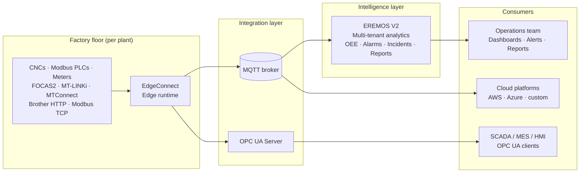

<!--
File:        docs/marketing/elpis-industrial-intelligence-platform-v2.md
Purpose:     Long-form joint datasheet for the Elpis Industrial Intelligence Platform
             (EdgeConnect + EREMOS V2). Plant manager / Ops VP audience.
Format:      Long-form web one-pager. A trimmed print PDF will derive from this.
Version:     v2 (post-review)
Date:        2026-05-24

Changes from v1:
  - Sharper operational hero (per review)
  - New "Designed for" qualifier section
  - New "Replace spreadsheet operations" commercial callout
  - Architecture sections converted to scannable bullets with bolded leads
  - Connectivity table split by category (CNC / PLC+instrumentation / Messaging / Enterprise integration)
  - New Mermaid architecture diagram placeholder (designer to replace with branded SVG)
  - New "Deploy incrementally" psychological-comfort section
  - New "Typical value areas" ROI framing box (no fabricated numbers)
  - Modifications applied vs ChatGPT review: "PLCs" tightened to "Modbus PLCs"; "Automotive"
    narrowed to "automotive parts and precision machining"; "Better maintenance planning"
    reframed as "planned maintenance from tool-life trends"

Locked-truth sources every claim traces to:
  - CLAUDE.md §1, §3 (EdgeConnect: product definition + locked architectural decisions)
  - docs/ARCHITECTURE_BLUEPRINT.md Appendix A
  - docs/platform-principles.md (P1–P6)
  - shared-knowledge/architecture-overview.md
  - shared-knowledge/common-modules.md
  - shared-knowledge/glossary.md
  - shared-knowledge/contracts/eremos-per-tag-mqtt.md
  - shared-knowledge/contracts/cnc-vocabulary.md
  - shared-knowledge/contracts/opcua-namespace-policy.md
  - User-confirmed EREMOS V2 features (incident workflow, alerting, reporting)
  - User-confirmed Northbound: OPC UA Server treated as shipped alongside MQTT

Do NOT add claims to this document without a matching entry in the sources above.
-->

# Elpis Industrial Intelligence Platform

**Unified industrial connectivity and operational intelligence for modern manufacturing.**

Connect CNCs, Modbus PLCs, and instrumentation into one real-time operational platform. Measure OEE on signals collected directly from the controller. Reduce downtime with persistent alarms and incident workflows. From the spindle to the dashboard, on one foundation.

---

## Designed for

- **Multi-vendor CNC manufacturing plants** running mixed Fanuc, Brother, Mazak and other controllers
- **Automotive parts and precision machining operations** with strict OEE accountability
- **Brownfield modernization projects** bringing legacy controllers into a modern analytics stack
- **OEM machine monitoring deployments** for builders shipping connected equipment
- **Multi-site industrial operations teams** standardizing the way every plant reports

---

## Outcomes you can hold us to

- **Cut unplanned downtime** by surfacing machine state changes the moment they happen, with persistent alarm tracking and incident workflows that close the loop from detection to resolution.
- **Trust your OEE number** because every input — cycle time, parts count, alarm state, planned stops — is collected directly from the controller and timestamped at the edge.
- **Modernize legacy controllers** — Fanuc 16i/18i, Brother S700Xd1, Modbus-fronted PLCs — without replacing them. EdgeConnect speaks their native protocols.
- **See your whole fleet** — multiple plants, multiple shifts, multiple vendors — on one operational view, with per-site identity and tenant isolation built into the platform.
- **Keep sensitive data where it belongs.** EdgeConnect is fully offline-capable. Send only what matters to the cloud, on your terms.
- **Pass your audit.** Hash-chained configuration history, per-tag quality codes, and signed offline licensing satisfy regulated-industry review without retrofitting.

The numbers you plug into a business case are yours. The platform that makes those numbers credible is ours.

---

## Replace spreadsheet operations

Most plants already have the data. What they lack is a system that produces:

- **Trusted timestamps** — every reading collected at the edge, not transcribed from a clipboard
- **Auditable OEE** — Segment-based math you can show an auditor
- **Persistent alarm history** — every fault on the record, not in someone's memory
- **Unified machine visibility** — one operational view across CNCs, PLCs, and meters
- **Centralized operational workflows** — shift reports as a record, not a phone call

The Elpis platform replaces disconnected spreadsheets and manual shift reporting with a real-time operational system built directly on machine data.

---

## How the platform is built

Two products, one architecture, one shared MQTT contract between them.

### Edge connectivity — EdgeConnect

A protocol-agnostic edge runtime that collects from every controller on your floor, normalizes the data once, and delivers it where it needs to go.

- **Native protocol coverage.** FOCAS2, MT-LINKi, MTConnect, Brother HTTP, Modbus TCP. One service speaks them all.
- **No lost production data.** Built-in edge buffering preserves data during network or broker outages and automatically replays it on reconnect.
- **Faults isolated, not contagious.** A failing protocol cannot affect a healthy one. A misbehaving sink cannot block another sink.
- **Three-way diagnostics.** Source, pipeline, sink — operators always see exactly where the data flow broke.
- **Connectivity Studio.** A modern web admin UI for adding sources, defining routes, configuring sinks, and running Test Connection probes before anything goes live.
- **Safe configuration.** Draft → validate → apply → rollback. No untested config ever reaches the data path.
- **Auditable changes.** Hash-chained configuration history records every change to the gateway, with actor and timestamp.

EdgeConnect runs as a service on the factory floor — Windows today, Linux on the roadmap.

### Operational intelligence — EREMOS V2

A multi-tenant analytics platform that turns machine data into operational decisions.

- **A real industrial asset model.** PLANT → AREA → LINE → EQUIPMENT → SUB_EQUIPMENT, with first-class Devices and Tags, units, engineering ranges, and quality codes.
- **OEE you can audit.** Availability × Performance × Quality, computed from time-bounded Segments built directly on edge-collected signals.
- **Alarms and incidents tracked.** Inbound CNC alarms become persistent records with open/close state and incident grouping.
- **Alerts on your channels.** Notifications routed to email, chat, and ticketing webhooks your operations team already uses.
- **Reports the team will actually read.** Shift reports, OEE summaries, downtime breakdowns, tool-life trends — PDF and Excel export included.
- **Tool life tracking.** Dedicated ingestion for tool wear and remaining-life telemetry so maintenance happens before failures.
- **Multi-tenant by design.** One deployment serves many sites or business units without data leakage.
- **Dashboards that scale to mixed fleets.** Panes split automatically by device class — CNC, PLC, DAQ, asset tracker, meter.

---

## Connectivity coverage

### CNC controllers (southbound)

| Protocol | Status | What it covers |
|---|---|---|
| **FOCAS2** | Available | Fanuc CNCs — axes, spindle, alarms, tool, production, programs |
| **MT-LINKi** | Available | Fanuc's REST-based machine-data product |
| **MTConnect** | Available | The industry-standard CNC streaming protocol |
| **Brother HTTP** | Available | Brother CNCs (S700Xd1 and similar) via the built-in web-monitoring interface |

### PLC and instrumentation (southbound)

| Protocol | Status | What it covers |
|---|---|---|
| **Modbus TCP** | Available | PLCs, drives, energy meters — any Modbus TCP device |

### Messaging (northbound)

| Protocol | Status | What it covers |
|---|---|---|
| **MQTT** | Available | Mosquitto, HiveMQ, EMQX, AWS IoT Core, Azure IoT Hub — any compliant broker. Batch or per-tag publish modes. |

### Enterprise integration (northbound)

| Protocol | Status | What it covers |
|---|---|---|
| **OPC UA Server** | Available | SCADA, MES, HMI, and any OPC UA client. ISA-95-style browse paths configurable per deployment. |

Every source delivers tags using a shared **canonical CNC vocabulary** — `running`, `spindle_rpm`, `feed_rate`, `parts_count`, `cycle_time`, axis positions, and so on. The same dashboard layout works across Fanuc, Brother, and Modbus-fronted machines. One semantics, many vendors.

---

## Architecture at a glance

<!--
DESIGNER NOTE: Replace this Mermaid block with a branded SVG diagram before
print PDF and website publication. The Mermaid version below is structurally
correct and renders on GitHub / most markdown viewers, but a hand-drawn
diagram in the Elpis visual identity (dark premium palette, steel grey,
deep navy) will read significantly better at sales-asset quality.
-->

*One EdgeConnect deploys at each plant. One EREMOS V2 tenant aggregates many sites. Standard MQTT and OPC UA make the integration interoperable with whatever else you run.*

---

## Deploy incrementally

Start with one machine, one line, or one plant. EdgeConnect runs side-by-side with whatever else you have today. EREMOS V2 onboards new sites without changing the platform underneath. There is no big-bang cutover, and no platform-wide upgrade that breaks the plants already running.

Most customers start with a single proof of value — one cell, one shift, one OEE definition — and expand from there. The architecture is designed to scale by addition, not by replacement.

---

## How it deploys

- **EdgeConnect at the edge.** One service per plant or per cell, sized to the controller count. Runs offline; no cloud dependency.
- **EREMOS V2 in your data center, in a private cloud, or as a managed service.** Multi-tenant by design — one deployment, many sites.
- **Connected by MQTT.** Standard industrial messaging. Works with Mosquitto, HiveMQ, EMQX, AWS IoT Core, Azure IoT Hub, or any compliant broker. The platform does not require Elpis to provide the broker.
- **Fleet-shaped.** Multi-plant deployments run an EdgeConnect at each site and aggregate to a single EREMOS V2 tenant. Per-gateway UUID and customer/site binding give the fleet a clean identity model.

---

## Where customers use it

- **Multi-vendor CNC floors.** Twenty to one hundred CNCs across Fanuc, Brother, and Mazak controllers, on one operational view, without per-machine custom scripting.
- **Brownfield modernization.** Fifteen-year-old Fanuc 16i/18i controllers brought into a modern analytics stack via native FOCAS2 polling. The controllers stay. The data layer modernizes.
- **OEE and production tracking.** Cycle time, parts count, alarm state, tool wear streaming into a real-time operational view — every input collected directly from the controller, every Segment built from authoritative data.
- **Multi-site fleets.** Ten-plus plants, each running EdgeConnect locally and reporting into a single EREMOS V2 tenant. Outages at any site buffer locally and replay on reconnect.
- **Hybrid edge plus cloud.** Sensitive plant data stays on premise. Filtered, aggregated KPIs flow to the cloud platform of your choice. Pay-per-egress savings are real.
- **Compliance and audit trails.** Hash-chained configuration history, per-tag quality codes, signed offline licensing — built for regulated-industry review, not bolted on afterward.

---

## Why Elpis

- **Protocol-agnostic core, not a gateway with bolted-on protocols.** EdgeConnect's runtime never references a specific protocol. Adapters plug in; the core stays clean. New controllers ship without destabilizing the ones already in production.
- **Edge-first, not cloud-first.** EdgeConnect runs for years on a small box in a control cabinet. Store-and-forward is mandatory. Offline operation is the default, not a fallback.
- **Three-way diagnostics, always.** Source, pipeline, sink — operators always know where the data flow broke. No silent failures, no five-hour root-cause hunts.
- **Offline, signed licensing.** RSA-signed JSON license files, fully offline. No phone-home to validate, no cloud dependency to license your edge runtime. Air-gapped factories are first-class.
- **License expiration never cuts customer data.** A lapsed license blocks configuration changes; it never stops the flow of production data. Your machines keep talking.
- **AI as decision support, never in the data path.** When AI features ship, they propose actions for humans to confirm — they do not silently alter the pipeline. Local-LLM support is mandatory; cloud LLMs are optional. No "secrets to a foundation model" concern on security review.
- **Per-protocol licensing.** Pay for the connectivity you actually use. Platform packaging is per-edition; underlying capability is modular.
- **Built for industrial workloads.** Not generic IoT software with a CNC marketing skin. The architecture, the vocabulary, the diagnostics, and the licensing are all shaped by industrial operations practice.

---

## Typical value areas

Where customers typically anchor their business case for the platform:

- **Reduced unplanned downtime** — through faster detection and persistent alarm tracking
- **Faster root-cause analysis** — three-way diagnostics on the data path, hash-chained audit on configuration
- **Improved OEE visibility** — single source of truth across the fleet
- **Reduced manual reporting effort** — automated shift reports replace spreadsheet stitching
- **Planned maintenance from tool-life trends** — schedule changeovers before tools fail mid-cycle
- **Standardized multi-site operations** — one platform, many sites, consistent KPIs

The numbers you plug into a business case are yours. We will help you build a model from your real production constants.

---

## Editions and modules

The Elpis Industrial Intelligence Platform is available in **Starter**, **Professional**, and **Enterprise** editions, with optional industrial connectivity modules including FOCAS2, MT-LINKi, MTConnect, Brother HTTP, Modbus TCP, MQTT, and OPC UA Server.

Contact Elpis for licensing details, edition feature lists, and deployment-scale pricing tailored to your fleet.

---

## On the roadmap

Capabilities currently in active engineering or scheduled for upcoming releases:

- **OPC UA Client** (southbound) — connect to OPC UA-native controllers and gateways
- **Siemens S7** (southbound) — native S7 driver for Siemens PLC fleets
- **HTTP and TCP sinks** (northbound) — direct delivery to REST endpoints and legacy TCP listeners
- **Linux host support** for EdgeConnect
- **AI-assisted operations agents** — Diagnostic, Configuration, Tag Mapping, and Intelligent Alerting — all decision-support, all human-confirmed, all local-LLM-capable

The roadmap exists in service of the platform's locked architectural principles, not the other way around. We add what fits.

---

## Next step

Bring us a representative plant — a controller mix, a target broker, an OEE definition — and we will scope a proof of value against it. Demos run on real protocols against your real signals, not on canned data.

**Contact:** [contact details — to be filled in by the user]

---

*Elpis Industrial Intelligence Platform — v2, 2026-05-24. EdgeConnect and EREMOS V2 are products of Elpis IT Solutions. Specifications and roadmap items are subject to change; contact us for the current authoritative product status.*
