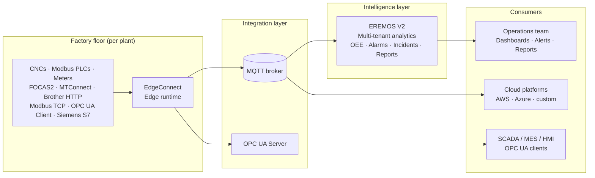

<!--
File:        docs/marketing/elpis-industrial-intelligence-platform-v5.md
Purpose:     Long-form joint datasheet for the Elpis Industrial Intelligence Platform
             (EdgeConnect + EREMOS V2). Plant manager / Ops VP audience.
             Phase E collateral refresh on the migrated solution-page foundation
             (design-system v3 §24 Q3 — "datasheet" refresh).
Format:      Long-form web one-pager. A trimmed print PDF will derive from this.
Version:     v5 (Phase E refresh — protocol-state correctness + ecosystem context +
             trust anchors + solution-page alignment)
Date:        2026-06-04

Scope (user direction 2026-06-04): "Refresh + light ecosystem context." Keep the
EdgeConnect + EREMOS V2 platform focus; apply the baseline corrections; ADD one
short "Part of the Industrial Intelligence Ecosystem" section situating the platform
among the 5 pillars (pointing to mDAQ / mTracker / VAS / E-IDOS + the coming product
pages) without diluting the Plant-manager focus or duplicating the Phase E product-
page track.

Changes from v4:
  - PROTOCOL-STATE CORRECTNESS (P-G, the same correction the Phase E solution-page
    migration applied; per CLAUDE.md §8 + locked connectivity-edge v2 + side-flag #1
    resolution 2026-06-04):
    * MT-LINKi REMOVED from the today-list everywhere it appeared (EdgeConnect
      native-coverage line, Connectivity-coverage CNC table, Mermaid diagram,
      Editions/modules) and moved to the roadmap. MT-LINKi has no Studio wizard /
      modular adapter today; do NOT re-add to the today-list until the engineering
      milestone ships.
    * Siemens S7 + OPC UA Client MOVED from the roadmap to Available (both are
      operator-available today). The v4 roadmap section listed them as upcoming —
      corrected.
    * FANUC MT-LINKi (REST) ADDED to the roadmap section.
    * HTTP/TCP sinks + Linux host support + AI agents remain on the roadmap (correct
      per CLAUDE.md §8).
  - VOCABULARY DISCIPLINE: "single source of truth across the fleet" (v4 §Typical
    value areas) dropped — it is a buyer-taxonomy §2.2 backfire term the locked
    solution pages ban. Rephrased to a non-cliché operational claim.
  - TRUST ANCHORS added (v4 carried none). Per positioning v3 §4 + amendment v4 §3/
    §4/§5. Caption phrasing RESOLVED at ChatGPT review (2026-06-04): use
    "Deployed in defense and space-agency programs" (positioning v3 §4 + Phase 2
    handoff §6 verbatim lock) — NOT the amendment-v4 "...customers" variant —
    for cross-surface consistency (homepage / platform / datasheet) and
    confidentiality (avoids implying named-customer disclosure). The two other
    anchors are verbatim: "Operating across India and the Middle East" (positioning
    v3 §4) and "Maintenance and AMC providers across India and the Middle East"
    (amendment v4 §5).
  - ECOSYSTEM CONTEXT: new "Part of the Industrial Intelligence Ecosystem" section —
    the 5 pillars (Connectivity & Edge, Data Acquisition / mDAQ, Asset Intelligence /
    mTracker, Condition Monitoring / VAS + E-IDOS, Operational Intelligence / EREMOS
    V2), honest about E-IDOS → EREMOS V2 streaming being near-term roadmap (per
    hardware-ecosystem-map v3 §5.2 + §6). Light reference, not full product detail —
    per-pillar depth lives on the Phase E product pages.
  - SOLUTION-PAGE ALIGNMENT: the 5 "Designed for" verticals now map 1:1 to the 5
    LOCKED /solutions pages (cnc-machining, precision-manufacturing, brownfield-
    modernization, oem-machine-monitoring, multi-site-operations) with cross-link
    cues for the web version.
  - EDGE GATEWAY: light mention as the appliance form of Connectivity & Edge
    (standalone PLC-to-cloud today; canonical EdgeConnect appliance once Linux ships)
    — honest dual-identity framing, appliance optional (software-only fully
    supported).
  - Anti-overclaim preserved: "cut" / "reduce" verbs; no fabricated %/$ metrics.
  - Version v4→v5; date 2026-06-04.

ChatGPT review (2026-06-04) — verdict "Approve with changes." 4 required
softenings applied before lock (all ACCEPT):
  1. §Outcomes "Pass your audit" → "Support audit review" ("satisfy regulated-
     industry review" → "give regulated-industry reviewers concrete operational
     evidence") — removes implied audit-outcome guarantee.
  2. §EdgeConnect "No lost production data" → "Buffered production data during
     outages" — removes the absolute headline; mechanism preserved.
  3. Trust anchor standardized to "Deployed in defense and space-agency programs"
     (see RESOLVED note above).
  4. §Where-customers "Pay-per-egress savings are real" → softened to "reducing
     unnecessary cloud transfer when only summary data needs to leave the plant" —
     removes an unproven financial claim.
Confirmed by review: protocol consistency PASSING across all 6 surfaces
(native-coverage / CNC table / PLC-general table / Mermaid / editions / roadmap);
vocabulary clean (no "single source of truth" or other backfire clichés). Optional
refinements NOT applied: opening "Unified" tagline kept (review marked "not
required"; v4 continuity); "From the spindle to the dashboard, on one foundation"
kept (review endorsed). Print-PDF trim cue added to the ecosystem section.

Locked-truth sources every claim traces to:
  - CLAUDE.md §1, §3, §8 (EdgeConnect product definition + locked decisions +
    CURRENT operator-available protocol state — the authoritative today-list)
  - docs/ARCHITECTURE_BLUEPRINT.md Appendix A
  - docs/platform-principles.md (P1–P6)
  - shared-knowledge/architecture-overview.md, common-modules.md, glossary.md
  - shared-knowledge/contracts/eremos-per-tag-mqtt.md, cnc-vocabulary.md,
    opcua-namespace-policy.md
  - industrial-intelligence-ecosystem-positioning-v3.md §4 (trust anchors) + §2
    (pillars) + positioning-amendment-v4.md §3/§4/§5 (customer-name + AMC anchor
    governance; datasheet caption pattern)
  - hardware-ecosystem-map-v3.md §2-§6 (the 5 pillars + mDAQ/mTracker/VAS/E-IDOS +
    E-IDOS roadmap honesty)
  - buyer-taxonomy-v1.md §2.2 (Plant manager / Ops VP vocabulary discipline)
  - proof-architecture-v1.md §3/§4/§8 (no fabricated metrics / no customer names /
    no competitor names)
  - The 5 LOCKED /solutions page specs (page-solutions-*-spec-v1.md, 2026-06-04)
  - User-confirmed EREMOS V2 features (incident workflow, alerting, reporting)
  - User-confirmed Northbound: OPC UA Server treated as shipped alongside MQTT

Do NOT add claims to this document without a matching entry in the sources above.
In particular: do NOT re-add MT-LINKi to the today-list, and do NOT list S7 or
OPC UA Client as roadmap — both are corrected in v5 per CLAUDE.md §8.
-->

# Elpis Industrial Intelligence Platform

**Unified industrial connectivity and operational intelligence for modern manufacturing.**

Connect CNCs, Modbus PLCs, and instrumentation into one real-time operational platform. Measure OEE on signals collected directly from the controller. Reduce downtime with persistent alarms and incident workflows. From the spindle to the dashboard, on one foundation.

---

## Designed for

Each maps to a dedicated solution page on the Elpis site:

- **Multi-vendor CNC manufacturing plants** running mixed Fanuc, Brother, Mazak and other controllers → */solutions/cnc-machining*
- **Precision manufacturing operations** with strict OEE accountability → */solutions/precision-manufacturing*
- **Brownfield modernization projects** bringing legacy controllers into a modern analytics stack → */solutions/brownfield-modernization*
- **OEM machine monitoring deployments** for builders shipping connected equipment → */solutions/oem-machine-monitoring*
- **Multi-site industrial operations teams** standardizing the way every plant reports → */solutions/multi-site-operations*

---

## Outcomes you can hold us to

- **Cut unplanned downtime.** Surface machine state changes the moment they happen, with persistent alarm tracking and incident workflows that close the loop from detection to resolution.
- **Trust your OEE number.** Every input — cycle time, parts count, alarm state, planned stops — is collected directly from the controller and timestamped at the edge. The OEE definition stays yours: segments, shift schedule, and targets are configured to how your plant already defines OEE.
- **Modernize legacy controllers.** Fanuc 16i/18i, Brother S700Xd1, Modbus-fronted PLCs — EdgeConnect speaks their native protocols. No replacements required.
- **See your whole fleet.** Multiple plants, multiple shifts, multiple vendors on one operational view, with per-site identity built in.
- **Keep sensitive data where it belongs.** EdgeConnect is fully offline-capable. Send only what matters to the cloud, on your terms.
- **Support audit review.** Hash-chained configuration history, per-tag quality codes, and signed offline licensing give regulated-industry reviewers concrete operational evidence without retrofitting.

---

## Replace spreadsheet operations

Most plants already have the data. What they lack is a system that produces:

- **Trusted timestamps** — every reading collected at the edge, not transcribed from a clipboard
- **Auditable OEE** — Segment-based math you can show an auditor
- **Persistent alarm history** — every fault on the record, not in someone's memory
- **Unified machine visibility** — one operational view across CNCs, PLCs, and meters
- **Centralized operational workflows** — shift reports as a record, not a phone call

The Elpis platform replaces disconnected spreadsheets and manual shift reporting with a real-time operational system built directly on machine data.

---

## How the platform is built

### Edge connectivity — EdgeConnect

A protocol-agnostic edge runtime that collects from every controller on your floor, normalizes the data once, and delivers it where it needs to go.

- **Native protocol coverage.** FOCAS2, MTConnect, Brother HTTP, Modbus TCP, OPC UA Client, and Siemens S7. One service speaks them all.
- **Buffered production data during outages.** Built-in edge buffering preserves and replays queued data when network or broker connectivity returns.
- **Faults isolated, not contagious.** A failing protocol cannot affect a healthy one. A misbehaving sink cannot block another sink.
- **Three-way diagnostics.** Source, pipeline, sink — operators always see where the data flow broke.
- **Connectivity Studio.** A web admin UI for sources, routes, sinks, and Test Connection probes before anything goes live.
- **Safe configuration.** Draft → validate → apply → rollback. Untested config never reaches the data path.
- **Auditable changes.** Hash-chained configuration history records every change with actor and timestamp.

EdgeConnect runs on Windows today; Linux on the roadmap. For sites that prefer a turnkey box, the **Edge Gateway** appliance is an option — a ruggedized DIN-rail unit that ships today as a standalone PLC-to-cloud gateway and becomes the canonical EdgeConnect appliance once the Linux runtime ships. Software-only on your own hardware is fully supported; the appliance is a choice, not a requirement.

### Operational intelligence — EREMOS V2

A multi-tenant analytics platform that turns machine data into operational decisions.

- **A real industrial asset model.** PLANT → AREA → LINE → EQUIPMENT → SUB_EQUIPMENT, with first-class Devices and Tags, units, engineering ranges, and quality codes.
- **OEE you can audit.** Availability × Performance × Quality, computed from time-bounded Segments built on edge-collected signals.
- **Alarms and incidents tracked.** Inbound CNC alarms become persistent records with open/close state and incident grouping.
- **Alerts on your channels.** Notifications routed to email, chat, and ticketing webhooks your operations team already uses.
- **Reports the team will actually read.** Shift reports, OEE summaries, downtime breakdowns, tool-life trends — PDF and Excel export included.
- **Tool life tracking.** Dedicated ingestion for tool wear and remaining-life telemetry, so maintenance happens before failures.
- **Multi-tenant by design.** One deployment serves many sites or business units without data leakage.
- **Dashboards that scale to mixed fleets.** Panes split automatically by device class — CNC, PLC, DAQ, asset tracker, meter.

---

## Connectivity coverage

### CNC controllers (southbound)

| Protocol | Status | What it covers |
|---|---|---|
| **FOCAS2** | Available | Fanuc CNCs — axes, spindle, alarms, tool, production, programs |
| **MTConnect** | Available | The industry-standard CNC streaming protocol |
| **Brother HTTP** | Available | Brother CNCs (S700Xd1 and similar) via the built-in web-monitoring interface |

### PLC, instrumentation, and general industrial (southbound)

| Protocol | Status | What it covers |
|---|---|---|
| **Modbus TCP** | Available | PLCs, drives, energy meters — any Modbus TCP device |
| **OPC UA Client** | Available | OPC UA-native controllers, gateways, and servers across broad industrial equipment |
| **Siemens S7** | Available | Native S7 driver for Siemens PLC fleets |

### Messaging (northbound)

| Protocol | Status | What it covers |
|---|---|---|
| **MQTT** | Available | Mosquitto, HiveMQ, EMQX, AWS IoT Core, Azure IoT Hub — any compliant broker. Batch or per-tag publish modes. |

### Enterprise integration (northbound)

| Protocol | Status | What it covers |
|---|---|---|
| **OPC UA Server** | Available | SCADA, MES, HMI, and any OPC UA client. ISA-95-style browse paths configurable per deployment. |

Every source delivers tags using a shared **canonical CNC vocabulary** — `running`, `spindle_rpm`, `feed_rate`, `parts_count`, `cycle_time`, axis positions. The same dashboard layout works across Fanuc, Brother, Siemens, and Modbus-fronted machines. One semantics, many vendors.

*Also on the roadmap: FANUC MT-LINKi (REST). See "On the roadmap" below.*

---

## Part of the Industrial Intelligence Ecosystem

EdgeConnect and EREMOS V2 are the connectivity and operational-intelligence core of the broader **Elpis Industrial Intelligence Ecosystem** — five capability pillars that share one canonical data model and one intelligence stack:

| Pillar | What it answers | Product |
|---|---|---|
| **Connectivity & Edge** | "Get every controller on my floor into one normalized stream." | **EdgeConnect** (+ Edge Gateway appliance) |
| **Data Acquisition** | "I have no PLC, or I want to read sensors directly." | **mDAQ** |
| **Asset Intelligence** | "Track utilization, location, and OEE on equipment across sites." | **mTracker** |
| **Condition Monitoring** | "Move from break-fix to predict-and-prevent on rotating and hydraulic systems." | **VAS** (vibration) + **E-IDOS** (oil health) |
| **Operational Intelligence** | "Turn all of it into OEE, alarms, incidents, and reports." | **EREMOS V2** |

This datasheet covers the **EdgeConnect + EREMOS V2** platform — the connectivity-to-intelligence path most plants start with. The other pillars extend the same stack when the need arises: mDAQ for direct sensor acquisition, mTracker for fleet/asset telemetry, and VAS + E-IDOS for condition monitoring. mDAQ, mTracker, and VAS feed EREMOS V2 today; **E-IDOS streaming into EREMOS V2 (alarms, dashboards, incident workflows) is on the near-term roadmap** — until it ships, E-IDOS operates as a standalone oil-health instrument with on-site reporting. Per-pillar detail lives on the individual product pages.

<!--
PDF-TRIM CUE (per ChatGPT review 2026-06-04): for the trimmed print PDF, keep the
5-pillar table + the E-IDOS roadmap caveat; drop the surrounding prose paragraph
that doesn't help a plant manager decide. The full prose stays on the web one-pager.
-->

---

## Architecture at a glance

<!--
DESIGNER NOTE: Replace this Mermaid block with a branded SVG diagram before
print PDF and website publication. The Mermaid version below is structurally
correct and renders on GitHub / most markdown viewers, but a hand-drawn
diagram in the Elpis visual identity (dark premium palette, steel grey,
deep navy) will read significantly better at sales-asset quality. See
docs/marketing/architecture-diagram-spec-v3.md for the full designer brief.
-->

*One EdgeConnect deploys at each plant. One EREMOS V2 tenant aggregates many sites. Standard MQTT and OPC UA make the integration interoperable with whatever else you run.*

---

## Deploy incrementally

Start with one machine, one line, or one plant. EdgeConnect runs side-by-side with whatever else you have today. EREMOS V2 onboards new sites without changing the platform underneath. No big-bang cutover, no platform-wide upgrade that breaks the plants already running.

Typical proof-of-value deployments begin with a single line or machine cell and expand incrementally once operationally validated. The architecture scales by addition, not by replacement.

---

## How it deploys

- **EdgeConnect at the edge.** One service per plant or per cell, sized to the controller count. Runs offline; no cloud dependency. Software-only on your own hardware, or on the Edge Gateway appliance.
- **EREMOS V2 in your data center, a private cloud, or as a managed service.** Multi-tenant by design — one deployment, many sites.
- **Connected by standard MQTT.** Works with any compliant broker. The platform does not require Elpis to provide the broker.
- **Fleet-shaped.** Multi-plant deployments run an EdgeConnect at each site and aggregate to a single EREMOS V2 tenant. Per-gateway UUID and customer/site binding give the fleet a clean identity model — each plant keeps its own runtime and offline resilience; the fleet view comes from EREMOS V2 aggregating across them, never from one runtime spanning plants.

---

## Where customers use it

- **Multi-vendor CNC floors.** Twenty to a hundred CNCs across Fanuc, Brother, and Mazak controllers on one operational view, without per-machine custom scripting.
- **Brownfield modernization.** Fifteen-year-old Fanuc 16i/18i controllers brought into a modern analytics stack via native FOCAS2 polling. The controllers stay; the data layer modernizes.
- **OEE and production tracking.** Cycle time, parts count, alarm state, tool wear streaming into a real-time operational view — every input collected directly from the controller.
- **Multi-site fleets.** Ten-plus plants, each running EdgeConnect locally and reporting into a single EREMOS V2 tenant. Outages buffer locally and replay on reconnect.
- **Hybrid edge plus cloud.** Sensitive plant data stays on premise. Filtered, aggregated KPIs flow to the cloud platform of your choice, reducing unnecessary cloud transfer when only summary data needs to leave the plant.
- **Compliance and audit trails.** Hash-chained configuration history, per-tag quality codes, signed offline licensing — built for regulated-industry review, not bolted on afterward.

---

## Where Elpis is deployed

- **Deployed in defense and space-agency programs** — precision rotating-equipment and fluid-condition monitoring programs, with named customers confidential.
- **Operating across India and the Middle East** — current deployment footprint.
- **Maintenance and AMC providers across India and the Middle East** use the Elpis tools to deliver their own service contracts.

*(Specific customer names and case studies arrive with the Phase 3 customer-story program. The category descriptors above are the standing, authorized proof.)*

---

## Why Elpis

- **New protocols ship without breaking the old ones.** EdgeConnect's runtime is protocol-agnostic by architecture, not by accident — adapters plug in; the core stays clean.
- **Built to run for years on a small box in a control cabinet.** Edge-first, not cloud-first. Store-and-forward is mandatory. Offline operation is the default.
- **Operators always know where the data flow broke.** Three-way diagnostics — source, pipeline, sink — by design. No silent failures.
- **Air-gapped factories are first-class.** RSA-signed JSON license files, fully offline. No phone-home to validate the runtime.
- **A lapsed license never stops production data.** Expiration blocks configuration changes only. Your machines keep talking.
- **AI proposes; humans decide.** When AI features ship, they propose actions for humans to confirm — they do not silently alter the data path. Local-LLM support is mandatory; cloud LLMs are optional.
- **Pay for the connectivity you actually use.** Per-edition packaging with modular per-protocol activation.
- **Built for industrial workloads, not adapted IoT software.** The architecture, vocabulary, diagnostics, and licensing are shaped by OT operations practice.

---

## Typical value areas

Where customers typically anchor their business case for the platform:

- **Reduced unplanned downtime** — through faster detection and persistent alarm tracking
- **Faster root-cause analysis** — three-way diagnostics on the data path, hash-chained audit on configuration
- **Consistent OEE across the fleet** — the same Segment-based math at every site, every shift, every vendor controller, instead of numbers stitched together by hand
- **Reduced manual reporting effort** — automated shift reports replace spreadsheet stitching
- **Planned maintenance from tool-life trends** — schedule changeovers before tools fail mid-cycle
- **Standardized multi-site operations** — one platform, many sites, consistent KPIs

The numbers you plug into a business case are yours. We will help you build a model from your real production constants.

---

## Editions and modules

The Elpis Industrial Intelligence Platform is available in **Starter**, **Professional**, and **Enterprise** editions, with optional industrial connectivity modules including FOCAS2, MTConnect, Brother HTTP, Modbus TCP, OPC UA Client, Siemens S7, MQTT, and OPC UA Server.

Contact Elpis for licensing details, edition feature lists, and deployment-scale pricing tailored to your fleet.

---

## On the roadmap

Capabilities in active engineering or scheduled for upcoming releases:

- **FANUC MT-LINKi (REST)** (southbound) — Fanuc's REST-based machine-data product, via its REST API
- **HTTP and TCP sinks** (northbound) — direct delivery to REST endpoints and legacy TCP listeners
- **Linux host support** for EdgeConnect — deploying on the Edge Gateway appliance as the canonical EdgeConnect appliance
- **E-IDOS → EREMOS V2 streaming** — oil-health alarms, dashboards, and incident workflows in the same stack (E-IDOS runs as a standalone instrument until then)
- **AI-assisted operations agents** — Diagnostic, Configuration, Tag Mapping, and Intelligent Alerting — all decision-support, all human-confirmed, all local-LLM-capable

---

## Next step

Bring us a representative plant — a controller mix, a target broker, an OEE definition — and we will scope a proof of value against it. Demos run on real protocols against your real signals, not on canned data.

**Contact:** [contact details — to be filled in by the user]

---

*Elpis Industrial Intelligence Platform — v5 **LOCKED 2026-06-04** after ChatGPT review (verdict "Approve with changes"; 4 required softenings applied — audit wording, buffered-data absolute, trust-anchor standardization, pay-per-egress claim). EdgeConnect and EREMOS V2 are products of Elpis IT Solutions. Phase E collateral refresh: protocol-state correctness (MT-LINKi → roadmap; Siemens S7 + OPC UA Client → available, per CLAUDE.md §8), light Industrial Intelligence Ecosystem context (5 pillars; E-IDOS → EREMOS V2 streaming honest-as-roadmap), locked trust anchors ("Deployed in defense and space-agency programs" / "Operating across India and the Middle East" / "Maintenance and AMC providers across India and the Middle East"), and alignment to the 5 locked /solutions pages. Specifications and roadmap items are subject to change; contact us for the current authoritative product status.*
